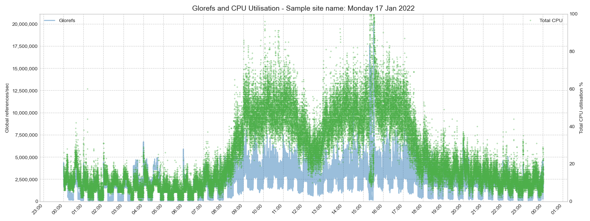
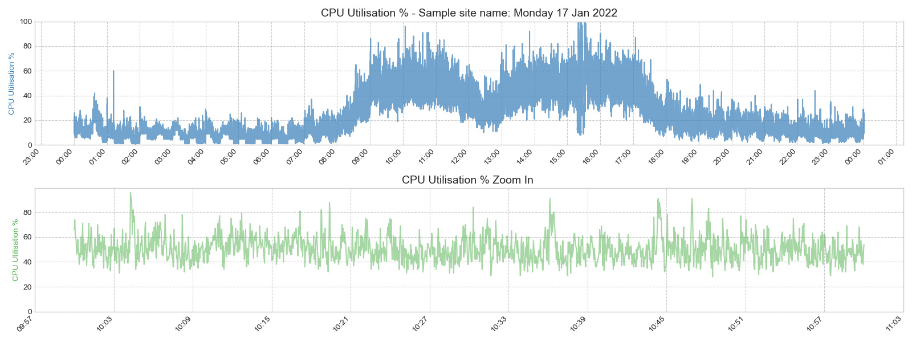
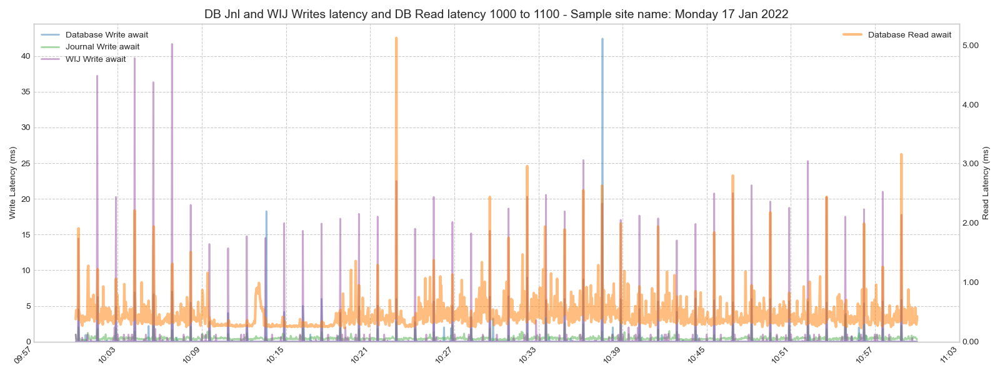
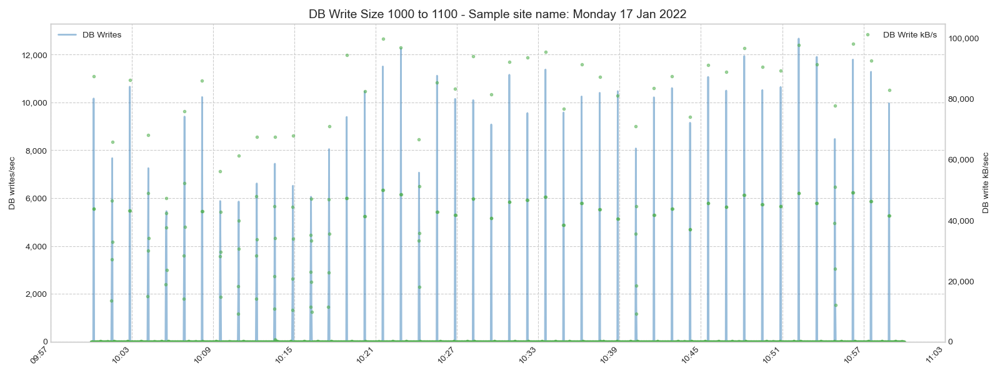
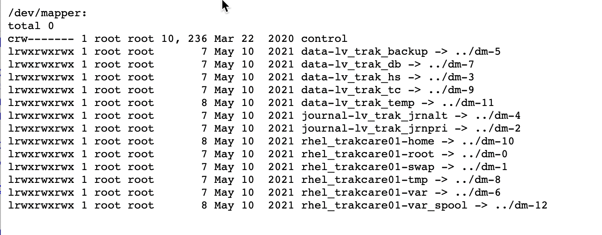
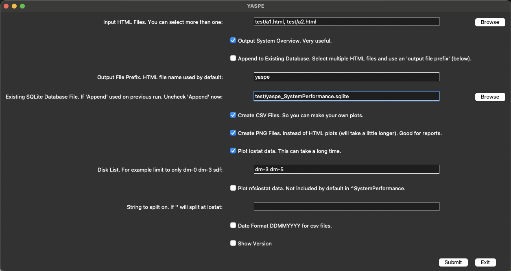
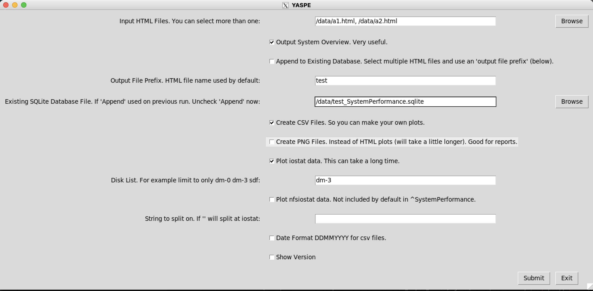

# yaspe

Parse and chart InterSystems Caché pButtons and InterSystems IRIS SystemPerformance files.

For combining metrics from mgstat, iostat and vmstat see [Pretty Performance](#Pretty-Performance) below.

What do all these metrics mean? See my posts on the [Intersystems Community](https://community.intersystems.com/post/intersystems-data-platforms-capacity-planning-and-performance-series-index)

# Yet Another System Performance Extractor

This is a replacement for [yape](https://github.com/murrayo/yape). There will be no more development on `yape`.

I will add functionality to `yaspe` as I need it. I use these tools pretty much daily, so there are frequent updates; which is not the same as support ;)
However, if you find bugs, or are looking for enhancements let me know!

> **NOTE:** `yaspe` currently only supports:
>- IRIS/Caché (mgstat)
>- Linux (vmstat, iostat)
>- Windows (Perfmon)
>- AIX (vmstat, iostat, sar -d)

## Recent version at Docker Hub

### Apple ARM

For Apple ARM (M1, M2 etc): `docker pull murray1oldfield/yaspe:latest_M1`

### Intel x86

Note: I don't have desktop access to an Intel server, so this image can fall behind. I suggest **Create docker container image** below.

For Intel: `docker pull murray1oldfield/yaspe:latest`


## Create docker container image for latest version

To create a docker image **_on your own system_** (i.e. Not use the image on Docker Hub):

- Download the source files
- logon to docker with: `docker login`
- `cd` to folder with source files
- Build `yaspe` container image: `docker build --no-cache -t yaspe .`

There are also instructions for [running without docker](#Running-without-a-container)

## Run the command over a pButtons or SystemPerformance file

See the help text (note the differences in image name depending on your situation):

For docker hub version:

For Apple ARM:

`docker run -v "$(pwd)":/data --rm --name yaspe murray1oldfield/yaspe:latest_M1 ./yaspe.py -h`

For Intel:

`docker run -v "$(pwd)":/data --rm --name yaspe murray1oldfield/yaspe:latest ./yaspe.py -h`

For local version:

`docker run -v "$(pwd)":/data --rm --name yaspe yaspe ./yaspe.py -h`

``` commandline
usage: yaspe [-h] [-v] [-i "/path/file.html"] [-x] [-n] [-a] [-o "output file prefix"] [-e "/path/filename_SystemPerformance.sqlite"] [-c] [-p]
             [-s] [-D] [-d DISK_LIST [DISK_LIST ...]] [-l "string to split on"]

Performance file review.

options:
  -h, --help            show this help message and exit
  -v, --version         show program's version number and exit
  -i "/path/file.html", --input_file "/path/file.html"
                        Input html filename with full path.
  -x, --iostat          Also plot iostat data (can take a long time).
  -n, --nfsiostat       Also plot nfsiostat data.
  -a, --append          Do not overwrite database, append to existing database.
  -o "output file prefix", --output_prefix "output file prefix"
                        Output filename prefix, defaults to html file name, blank (-o '') is legal.
  -e "/path/filename_SystemPerformance.sqlite", --existing_database "/path/filename_SystemPerformance.sqlite"
                        Chart existing database, full path and filename to existing database.
  -c, --csv             Create csv files of each html files metrics, append if csv file exists.
  -p, --png             Create png files of metrics. Instead of html
  -s, --system          Output system overview.
  -D, --DDMMYYYY        Date format for csv files is DDMMYYYY
  -d DISK_LIST [DISK_LIST ...], --disk_list DISK_LIST [DISK_LIST ...]
                        List of disks, if not entered all are processed. No commas or quotes, e.g. -d dm-0 dm-1
  -l "string to split on", --large_file_split_on_string "string to split on"
                        Split large input file on first occurrence of this string. Blank -l "" defaults to "div id=iostat"

Be safe, "quote the path"
```

For example, change to the folder with a SystemPerformance html file and run the command:

### Local

``` commandline
docker run -v "$(pwd)":/data --rm --name yaspe yaspe ./yaspe.py -i /data/mysystems_systemperformance_24hour_1sec.html
```

### For intel container

``` commandline
docker run -v "$(pwd)":/data --rm --name yaspe murray1oldfield/yaspe:latest ./yaspe.py -i /data/mysystems_systemperformance_24hour_1sec.html
```

If you want simple png files rather than html: smaller and quicker to look through: Use the `-p` option.

``` commandline
docker run -v "$(pwd)":/data --rm --name yaspe yaspe ./yaspe.py -i /data/mysystems_systemperformance_24hour_1sec.html -p
```

If you care only about a selected list of disks you can optionally add a disk list. A list of devices without the `/dev/` for example:

``` commandline
docker run -v "$(pwd)":/data --rm --name yaspe yaspe ./yaspe.py -i /data/mysystems_systemperformance_24hour_1sec.html -p -x -d dm-0 dm-1
```

### For Apple ARM container

The difference is `_M1`

``` commandline
docker run -v "$(pwd)":/data --rm --name yaspe murray1oldfield/yaspe:latest_M1 ./yaspe.py -i /data/mysystems_systemperformance_24hour_1sec.html
```

<hr>

Or put the path to the folder with the html file in the docker volume parameter and put the html file name after `-i /data/` 

``` commandline
docker run -v "/path/to/folder/with html file":/data --rm --name yaspe yaspe ./yaspe.py -i /data/mysystems_systemperformance_24hour_1sec.html
```

<hr>

To run _yaspe_ over multiple input files, for example a few days or a week, use the following steps:

- Copy all the SystemPerformance html files to one folder
- Use the `-a` (append) option to put all the metrics in the database (also `-x` if you want iostat)
- Use the `-e` (existing database option) to chart the appended database (also `-x` if you want iostat)

__Note:__ This works by appending data to database that contains extracted SystemPerformance data.
If the SystemPerformance files have a short sample period this can result in long run times and large output files with many data points. 
It may be a bit clunky to work with in the browser.
I suggest you run over a week without iostat (`-x`), then use the method above to deep dive on a day or couple of days.

By default, output folders and files are prefixed with the html file name. 
To keep all the metric data in a single database use the `-o` argument to override the output file prefix.

Example of running over multiple days;
- change to the folder with the html files and run the commands, run:

``` commandline
for i in `ls *.html`;do docker run -v "$(pwd)":/data --rm --name yaspe yaspe ./yaspe.py -i /data/"${i}" -a -o "three_days"; done
```

The resulting database file will use the prefix, in this example; `three_days_SystemPerformance.sqlite`

To create charts for the accumulated days use the `-e` argument.

``` commandline
docker run -v "$(pwd)":/data --rm --name yaspe yaspe ./yaspe.py -e /data/three_days_SystemPerformance.sqlite
```

<hr>

## Output files

- HTML charts for all columns in mgstat and vmstat or windows perfmon and output to folders under `./prefix_metrics`
- It is optional to create charts for iostat as this can take a long time if there is a big disk list
- If you do not want the default prefix (html file name), override with `-o your_choice` or `-o ''` for no prefix.
- If you want a csv file for further processing use the `-c` argument. If you use `-c` with `-o` csv files (for example for multiple days) will append.

*Example output*

![alt text][logo]

<hr>

# Updates

Remove the old image and create a new one with updated source code

`docker rmi yaspe`

[logo]: https://github.com/murrayo/yaspe/blob/main/yaspe.gif "Example"

# System config check

_yaspe_ includes a system overview and basic config check (`-s`)

This check is designed to save you hunting through your SystemPerformance file looking for system details. 

- a full list of items found is in `[prefix]_overview_all.csv`
- The check also includes a basic configuration review in `[prefix]_overview.txt`

An example of `overview.txt` follows, the contents will be different on your system:

``` plaintext
System Summary for your site name

Hostname         : YOURHOST
Instance         : SHADOW
Operating system : Linux
Platform         : N/A
CPUs             : 24
Processor model  : Intel(R) Xeon(R) Gold 6248 CPU @ 2.50GHz
Memory           : 126 GB
Shared memory    : globals 71680 MB + routines 1023 MB + gmheap 1000 MB = 73,703 MB
Version          : Cache for UNIX (Red Hat Enterprise Linux for x86-64) 2018.1.4 (Build 505_1U) Thu May 28 2020 10:11:16 EDT
Date collected   : Profile run "24hours" started at 16:15:00 on Nov 22 2021.

Warnings:
- ** Insecure Private Webserver Enabled! **
- Journal freeze on error is not enabled. If journal IO errors occur database activity that occurs during this period cannot be restored.
- swappiness is 10. For databases 5 is recommended to adjust how aggressive the Linux kernel swaps memory pages to disk.
- Hugepages not set. For performance, memory efficiency and to protect the shared memory from paging out, use huge page memory space. It is not advisable to specify HugePages much higher than the shared memory amount because the unused memory are not be available to other components.
- dirty_background_ratio is 10. InterSystems recommends setting this parameter to 5. This setting is the maximum percentage of active memory that can be filled with dirty pages before pdflush begins to write them.
- dirty_ratio is 30. InterSystems recommends setting this parameter to 10. This setting is the maximum percentage of total memory that can be filled with dirty pages before processes are forced to write dirty buffers themselves during their time slice instead of being allowed to do more writes. These changes force the Linux pdflush daemon to write out dirty pages more often rather than queue large amounts of updates that can potentially flood the storage with a large burst of updates

Recommendations:
- Review and fix warnings above
- Set HugePages, see IRIS documentation: https://docs.intersystems.com/irislatest/csp/docbook/Doc.View.cls?KEY=GCI_prepare_install#GCI_memory_big_linux
- Total memory is 128,755 MB, 75% of total memory is 96,566 MB.
- Shared memory (globals+routines+gmheap) is 73,703 MB. (57% of total memory).
- Number of HugePages for 2048 KB page size for (73,703 MB + 5% buffer = 77,388 MB) is 38694

All instances on this host:
- >SHADOW            2018.1.4.505.1.a  56772  /cachesys
```

# My workflow

- First I create the system check and create the SQLite file (for later processing):

``` commandline
docker run -v "$(pwd)":/data --rm --name yaspe yaspe ./yaspe.py -i /data/SystemPerfomanceFileName.html -a -s -x -o yaspe
```

- Next I create the png files output for a quick look through key metrics:

``` commandline
docker run -v "$(pwd)":/data --rm --name yaspe yaspe ./yaspe.py -e /data/yaspe_SystemPerformance.sqlite -p
```

- If I want to zoom in or create output for reports to customers I create the html output:

``` commandline
docker run -v "$(pwd)":/data --rm --name yaspe yaspe ./yaspe.py -e /data/yaspe_SystemPerformance.sqlite -o html
```

Next steps:

- for a deeper dive I use the [Pretty Perforamnce](#Pretty-Performance) to combine different metrics. For example, vmstat (wa) with iostat w_await, etc

# Running without a container

`yaspe` is written in Python.

If you wish to run locally in the operating system, I suggest you create a separate Python virtual environment for `yaspe`.

There are many references for creating Python environments on the web. You can start with the official documentation:

- https://docs.python.org/3/tutorial/venv.html

`yaspe` is tested in Python 3.9. Specifically my test system is: 

``` commandline
python --version
Python 3.9.13
```

**Once you have set up your Python environment:**

- download the source files
- `cd` to folder with source files

See `requirements.txt` for the Python packages used. You will need to:

``` commandline
pip3 install -r requirements.txt
```

Once installed you can `cd` to the folder with your pButtons or SystemPerformance file(s) and run the following sequence:


- Create the system check and create the SQLite file (for later processing):

``` commandline
for i in `ls *.html`; do /path/to/yaspe/souce/you/downloaded/yaspe.py -i $i -a  -s -x -o yaspe;done
```

- Create the png files output for a quick look through key metrics:

``` commandline
/path/to/yaspe/souce/you/downloaded/yaspe.py -e yaspe_SystemPerformance.sqlite -p
```

- If you want to zoom in or create output for reports for others, create the html output:

``` commandline
/path/to/yaspe/souce/you/downloaded/yaspe.py -e yaspe_SystemPerformance.sqlite -o html
```
<hr>

# Pretty Performance

## Sample Charts

Below is the example custom chart, Glorefs (mgstat) and Total CPU utilisation (vmstat).



Below is one of the default images, which includes a zoom to specified time (or defaults to 13:00-14:00).



Another custom image included in the sample charts.yml file. This chart combines read and write latency for IRIS disks. (Awful WIJ write performance!)



Here is the same chart with all metrics on the left axis only (not as clear, but depends on the metrics).

_1000_to_1100_-_Sample_site_name_Monday_17_Jan_2022.png)

Maybe you care about IO throughput for a cloud disk...



<hr>

## Overview

pretty_performance uses the sqlite database created  by `yaspe` to make charts that can combine metrics for vmstat, iostat and mgstat. 
For example, this is handy if you need to output charts for performance reports.

There is also an option to output merged vmstat, iostat and mgstat as a csv file for you to work with in Excel or other ways.

Formatting and chart creation is driven from two yml files, I have included samples;

- charts.yml - Attributes of charts to produce. What columns to include etc.
- input.yml - Instance details such as site name and key disk names (e.g. database, WIJ, pri and alt journal, IRIS)

<hr>

## Look at the help

``` commandline
docker run -v "$(pwd)":/data --rm --name yaspe yaspe ./pretty_performance.py -h
usage: pretty_performance.py [-h] -f DB_FILENAME [-s ZOOM_START] [-e ZOOM_END]
                             -p PARAMATER_FILE [-i] [-m] [-x] [-c CHART_FILE]
                             [-o OUTPUT_DIR] [-l]

Create charts from Linux pButtons and SystemPerformance data already stored in
sqlite3 file

optional arguments:
  -h, --help            show this help message and exit
  -f DB_FILENAME, --db_filename DB_FILENAME
                        db path and file name
  -s ZOOM_START, --zoom_start ZOOM_START
                        Start time for zoom
  -e ZOOM_END, --zoom_end ZOOM_END
                        Stop time for zoom
  -p PARAMATER_FILE, --paramater_file PARAMATER_FILE
                        Input for standard definitions
  -i, --include_iostat_plots
                        Include standard default iostat plots
  -m, --include_mgstat_plots
                        Include standard mgstat plots
  -x, --output_csv_file
                        output csv file
  -c CHART_FILE, --chart_file CHART_FILE
                        Chart file definitions
  -o OUTPUT_DIR, --output_dir OUTPUT_DIR
                        override output directory
  -l, --limit_yaxis     limit y axis to 3 sigma maximum
```
<hr>

## Workflow

### A. Create sqlite file using yaspe

One of the outputs of `yaspe` is an SQLite file with all the SystemPerformance metrics. e.g. `yaspe_SystemPerformance.sqlite`

Hint: Use default plots to see what it is you want to look at or deep dive in to.
If you already know what columns you care about, you can simply run yaspe to only create the sqlite file.

> **NOTE:** Currently only supports Linux. Specifically;
>- IRIS/Caché (mgstat)
>- Linux (vmstat, iostat)

For example:

`docker run -v "$(pwd)":/data --rm --name yaspe yaspe ./yaspe.py -i /data/your_html_file_name.html -x -a -c -s -o "yaspe"`

**Note:** `-x` to include iostat. I used `-a` to skip the step of creating html charts in yaspe.

The resulting sqlite file name is derived from the `-o` parameter: `yaspe_SystemPerformance.sqlite`

### B. Edit yml files

- charts.yml - Attributes of charts to produce. You can leave as defaults until you need to drill in to see specific requirements.
- input.yml - Instance details such as site name and key disks. **This file will be unique to the site**

You will need the disk /dev names for Database, Primary and Alternate Journal, WIJ, and Caché/IRIS disk. 
They can all be the same device if that is how your system is set up. See the notes below for changing the defaults for charts.yml.

If you need clues to the device names look at the Linux info `/dev/mapper` section in the SystemPerformance html file. 
For example; you can see below that the main IRIS database is on dm-7, journals are on dm-4 and dm-2, IRIS in this case is on dm-3, and so is the WIJ.



### C. Run the script

Below is an example using optional flags to start the zoom charts at 10:00 and end at 11:00:

`docker run -v "$(pwd)":/data --rm --name yaspe yaspe ./pretty_performance.py -f /data/yaspe_SystemPerformance.sqlite -s 10:00 -e 11:00 -p /data/input.yml -i -m -c /data/charts.yml -o ./pretty_yaspe`

_Note: This example assumes:_

- You have `cd` to the folder with the sqlite file.
- You have edited `charts.yml` and `input.yml`, and they are in the same folder as the sqlite file (otherwise specify a path).
- There is data for the time period between `-s` and `-e` times!

## yml Configuration

The following example shows an example of the input.yml file:

``` yaml
Site Name: "- Sample Site Name"
Disk List:
    Database: "dm-7"
    Primary Journal: "dm-2"
    Alternate Journal: "dm-4"
    WIJ: "dm-3"
    IRIS: "dm-3"
Colormap Name: "Set1"
DPI: 300
WIDTH: 16
HEIGHT: 6
MEDIAN: False
Moving Average: 60
```

- Site Name : Is text that appears in the title of all charts, and is also used as part of the file name.
- Disk List : Section is unique to your site. Use the last part of the device name. e.g.: /dev/sde is sde, /dev/dm-5 is dm-5 etc.
- Colormap Name : Do not change
- DPI : Chart dots per inch, 300 is print level quality, 80 is fine for screens.
- WIDTH : Chart width in inches.
- HEIGHT : Chart height in inches.
- MEDIAN : Do not change.
- Moving Average : Do not change.

The following example shows an example of _part_ of the charts.yml file:

``` yaml
Glorefs and vmstat:  
    Title: "Glorefs and vmstat"
    columns_to_show:
        column1: {"Text": "Glorefs", "Name": "Glorefs_mg", "axis": "left", "Style": "-", "Linewidth": 2, "Markerstyle": "", "Markersize": 1 }
        column2: {"Text": "Total CPU", "Name": "Total CPU_vm", "axis": "right", "Style": "", "Linewidth": 2, "Markerstyle": "+", "Markersize": 3 }   
    zoom: False
    y_label_l: "Global references/sec"
    y_label_r: "Total CPU utilisation %"  
    y_max_l: 0
    y_max_r: 100           
```

- Title : text appears in the title area of the chart, and is also used as part of the file name.
- Columns to show : section lists each plot line, there is no hard limit on the number of lines (see Column names below).
- column# : This section, one per plot line, lists pairs of keys with attributes. Attributes are:

  - Text : Legend for the plot line.
  - Name : Column name from the sqlite database.
  - axis : y axis; left or right
  - Style : blank ("") if a marker, eg a dot or triangle etc will be used, else one of [these Styles](https://matplotlib.org/stable/api/markers_api.html).
  - Linewidth : if a line style, the width.
  - Markerstyle : if Style is "" the marker style.
  - Markersize : If marker is used the size.

- zoom : if True, the chart x axis will limited to times specified in the command line time selection options -s and -e.
- ylabel_l : The left hand side y label.
- ylabel_r : The right hand side y label.
- y_max_l : Maximum y axis left, e.g. 100 if you are showing %. 0 for max(). All charts start at 0.
- y_max_r : Maximum y axis right.

**Column names**

Column names are derived from _mgstat, _vmstat, and the disk types in input.yml, for example;

- `_db` is Database metrics columns.
- `_pri` is Primary journal metrics.
- `_wij` is WIJ metrics.
- `_mg` is mgstat.
- `_vm` is vmstat.

Partial list, you should get the idea. Check out the `.csv` output for a full list:

`datetime,rrqm/s_db,wrqm/s_db,r/s_db,w/s_db,rkB/s_db,wkB/s_db,avgrq-sz_db,avgqu-sz_db,await_db,r_await_db,w_await_db,svctm_db,%util_db,rrqm/s_pri,wrqm/s_pri,r/s_pri,w/s_pri,rkB/s_pri,wkB/s_pri,avgrq-sz_pri,avgqu-sz_pri,await_pri,r_await_pri,w_await_pri,svctm_pri,%util_pri,rrqm/s_wij,wrqm/s_wij,r/s_wij,w/s_wij,rkB/s_wij,wkB/s_wij,avgrq-sz_wij,avgqu-sz_wij,await_wij,r_await_wij,w_await_wij,svctm_wij,%util_wij,Glorefs_mg,RemGrefs_mg,GRratio_mg,PhyRds_mg,Rdratio_mg,Gloupds_mg,RemGupds_mg,Rourefs_mg,RemRrefs_mg,RouLaS_mg,RemRLaS_mg,PhyWrs_mg,WDQsz_mg,WDtmpq_mg,WDphase_mg,WIJwri_mg,RouCMs_mg,Jrnwrts_mg,ActECP_mg,Addblk_mg,PrgBufL_mg,PrgSrvR_mg,BytSnt_mg,BytRcd_mg,WDpass_mg,IJUcnt_mg,IJULock_mg,PPGrefs_mg,PPGupds_mg,r_vm,b_vm,swpd_vm,free_vm,buff_vm,cache_vm,si_vm,so_vm,bi_vm,bo_vm,in_vm,cs_vm,us_vm,sy_vm,id_vm,wa_vm,st_vm,Total CPU_vm`

<hr>

# Interactive Interface

If you are using a local copy of yaspe you can run `yaspe_runner.py`.



## Interactive Interface in a container - OSX

It is a common issue when trying to run graphical applications inside Docker containers on macOS.
- To use interactive applications requires XQuartz for X11 forwarding. 

>**Note this step requires a system restart!!**

1. **Ensure XQuartz is installed and running**:
    
    - Download and install XQuartz from [XQuartz.org](https://www.xquartz.org/).
    - Open XQuartz and go to `Preferences > Security` 
      - And make sure the option **"Allow connections from network clients"** is checked.
    - Restart XQuartz. It is now an app on the laptop.

2. To run the interface you need to do this in your terminal. 

>**Start the container from the directory with the SystemPerformance HTML files, or a directory higher in the tree.**
> The HTML files will be in the /data directory or below (you will map `"$(pwd)":/data`) in the `docker run` command.

```bash
# Allow connections to the X server 
xhost +localhost

# Set the DISPLAY environment variable 
export DISPLAY=:0

# Run the Docker container 
docker run -v "$(pwd)":/data -v /tmp/.X11-unix:/tmp/.X11-unix -e DISPLAY=host.docker.internal:0 --rm --name yaspe yaspe ./yaspe_runner.py

```

The X11 screen will look like this:



<hr>


